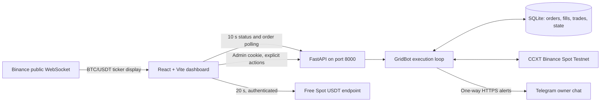

# Grid Master — System Architecture & Feature Summary

Grid Master is a human-directed BTC/USDT grid-trading system for **Binance Spot Testnet**. A Python engine manages orders and persistent risk state; a FastAPI service exposes telemetry and authenticated controls; a React dashboard presents the account, grid, and market data. Telegram is an outbound alert channel only.

> **Scope:** The exchange client explicitly enables Binance Spot sandbox mode. This repository has not been validated for live Mainnet capital. The browser's prominent streaming price, execution, ATR, order-book data, and wallet balances all come from **Spot Testnet**. The browser stream and backend ticker are separate observations and can briefly differ.

## Architecture at a glance



The backend source is in this directory. The frontend is the sibling `web-dashboard/` project in the development workspace. `main.py` runs the trading loop, FastAPI, and asynchronous market-data refresh in one process. SQLite records order and trade history, active settings, trailing-stop state, pause modes, and reset progress so the bot can reconcile state after a restart. `database.py` uses decimal strings for monetary values; `exchange_handler.py` creates the rate-limited, sandboxed CCXT client.

## Core execution engine

### Start and trade lifecycle

1. **Ready service:** `main.py --ready` serves the API and market intelligence with `engine_status=IDLE`, even if a saved grid exists. A service restart returns ordinary grid trading to IDLE and reconciles/cancels bot-owned open orders. An unresolved hard-stop liquidation remains a safety exception. The authenticated top-bar Master Switch is the only normal path from IDLE to RUNNING.
2. **Human approval:** The operator supplies center price, ceiling, hard stop, allocated USDT, and an **exact total** of BUY plus SELL levels. The API validates the live Testnet price, exchange precision, order size, and available capital before accepting the request. In ready mode this saves a pending grid; it places no orders until the operator presses **START**.
3. **Initial inventory:** The configured `initial_inventory_percent` (50% in the current configuration) funds a seed market BUY. Its BTC is divided among upper SELL limits. The remaining quote allocation funds lower BUY limits.
4. **Geometric grid:** The engine calculates exact geometric price levels between the center and each bound. For an odd level count, the BUY side gets one extra level. Each limit order is sent **Post-Only** (`timeInForce: PO`) with a bot-specific client order ID. An order that would immediately take liquidity is logged and deferred to a later cycle.
5. **Fill rotation:** A filled BUY creates a corresponding SELL sized from its executed BTC minus BTC-denominated commissions, rounded through CCXT's exchange precision, and checked against free bot-owned BTC. If execution details or free BTC have not caught up, placement waits for another cycle. A definitive insufficient-balance SELL rejection also leaves the lane available for retry. A filled SELL records realized trade profit and re-arms a BUY at the corresponding grid lane when conditions allow. The grid rotates through price levels; a completed sell does not permanently reduce its configured lane count.

This is spread-capture grid trading, **not risk-free arbitrage**. Fees, gaps, inventory exposure, and adverse trends can exceed the spread earned by completed cycles. The order ledger and status card count currently active/open orders; that number can temporarily differ from the configured number of price levels during fills, pauses, Post-Only rejections, and reconciliation.

### Master engine switch

The authenticated `POST /api/engine/stop` persists `engine_status=IDLE` before canceling and reconciling **both BUY and SELL bot-owned grid orders**. It leaves unrelated account orders and bot-held BTC alone. The ready-mode loop skips all new grid placement while IDLE; the Testnet dashboard ticker and market-intelligence refresh continue. **IDLE also suspends automated trailing-stop enforcement.** Bot-held BTC remains exposed to price changes.

`POST /api/engine/start` requires saved grid settings and revalidates market price, order state, exchange precision, quote balance, and carried BTC. After a stop it queues a carry-aware rebuild using the saved grid bounds and level counts; it does not sell retained BTC. A fresh grid needs settings saved first. A liquidation lock, unresolved trading fault, or incompatible safety pause blocks START. Both endpoints require the admin cookie and trusted dashboard origin. Manual Safety Pause remains a separate BUY-only risk control.

### ATR-assisted parameters

The backend fetches 15 one-hour Testnet candles and computes 14-period Average True Range (ATR) with `pandas_ta`; it also reports ATR as a percentage of the latest close. The dashboard's **Auto-Fill via ATR** button is an optional, frontend-only proposal based on the operator's entered center `C` and ATR `A`:

| Proposed value | Formula |
| --- | --- |
| Ceiling | `C + 2A` |
| Projected lower bound | `C - 2A` |
| Initial hard stop | `C - 2.2A` |
| Width per side | `(ceiling - C) / C × 100` |

The proposed stop is therefore **0.2 ATR below the projected lower bound** at entry. The form previews the width, lower bound, stop distance, and estimated order size. Auto-Fill only populates fields; the operator must review them and explicitly save settings, then press **START**. Manual values can create a wider gap, subject to backend validation, so the tight stop is a template rather than a global guarantee. ATR is descriptive market data, not an automatic trade signal.

## Capital and order-risk controls

| Layer | Implemented behavior |
| --- | --- |
| Frontend capital gate | `MIN_NOTIONAL = 7 USDT`; the form shows `allocated capital / total levels` and disables submission when capital is below `levels × 7 × 1.15`. It also warns when allocation exceeds the displayed free USDT balance. |
| Backend order-size check | Before placement, CCXT rounds prices and quantities to exchange precision. The engine checks amount and notional market limits plus its own **7 USDT per grid order** floor. It also checks conservative reverse SELL sizes, since a valid BUY can otherwise produce an undersized SELL. |
| Pre-flight balances | The backend sums exchange-rounded BUY costs (plus the seed BUY when needed) against **free Spot USDT**; it checks bot-available BTC for initial SELL limits. Insufficient capital rejects the start/re-anchor before a partial grid is created. |
| Runtime sizing pause | If a later order becomes undersized, the engine persists `PAUSED_SIZING`, cancels bot BUY limits, leaves SELL limits and risk monitoring in place, and requires a valid re-anchor to resume. |
| Order ownership | New orders use a persisted, unique `gridbot…` client-order namespace. Normal pause, reset, and liquidation cancellation targets matching bot orders and reconciles tracked SQLite rows; unrelated account orders are not intentionally canceled. |
| Uncertain submissions | An ambiguous exchange response is treated as an uncertain order requiring reconciliation, rather than blindly retrying and risking a duplicate. |

The frontend estimate is deliberately coarse. Binance filters, precision rounding, seed allocation, and the size of the reverse order are decided by the backend's more exact checks. A green UI preview is **not** a guarantee that an exchange request will be accepted.

## Trailing protection, pauses, and liquidation

### Auto-trailing hard stop

When a grid is anchored, the bot persists a `high_water_mark` initialized to the center and a `stop_loss_distance = center - initial_stop`. On each newly observed Testnet price above the high-water mark, it updates the mark and raises the stop to at least `high_water_mark - stop_loss_distance`. The floor never moves downward. The dashboard displays both values. Raising the floor can cause BUY limits at or below it to be canceled; those prices cannot be repopulated while beneath the active stop.

**Raise Hard Stop** is a separate authenticated control. It only accepts a value above the current floor and below the grid's lower bound, updates persisted trailing state, and does not rebuild the grid. A manual re-anchor is rejected if its proposed hard stop would lower the active trailing floor.

### Safety pause

The operator can enable **Manual Safety Pause**, which cancels **bot-owned BUY limits only** and leaves existing SELL limits active. The mode survives a restart and remains until manually released. If the operator releases a manual pause while price is at or below the lower bound, the bot records `PAUSED_DOWNSIDE`; that mode clears automatically after price rises above the lower bound. Missing BUYs are restored only when each price is safely below the current market and above the hard stop, respecting Post-Only placement.

**Current implementation gap:** Crossing below the lower bound during ordinary active trading prevents *new* BUY placement, but does **not** independently enter `PAUSED_DOWNSIDE` or cancel already-open BUYs. To cancel those BUYs before the hard stop, use Manual Safety Pause. The hard-stop liquidation trigger remains active.

### Hard-stop liquidation

When the bot's polled Testnet ticker falls **strictly below** the dynamic hard stop, it enters a durable `LIQUIDATING` workflow:

1. Cancel and verify all **bot-owned** open BUY and SELL orders for the pair.
2. Reconcile bot-tracked BTC lots against the exchange's freshly fetched **free BTC**. Never submit more than `min(tracked BTC, free BTC)`.
3. Check precision, limit-order lot size, and notional. Submit a GTC limit SELL for tradable bot BTC at 99.95% of the triggered hard-stop price, rounded to exchange price precision. Record unsellable dust separately in the liquidation audit state.
4. Keep the bot locked in `LIQUIDATING` while the limit is open, including after a process restart. Confirm fills with the exchange order ID and quantity before marking the run `LIQUIDATED`. If a partially filled limit is canceled or expires, reconcile the fill and submit a new limit for the sellable remainder. Transient exchange/network errors retry with delay and reconciliation; rate-limit errors use a longer delay. Permanent or unverifiable conditions enter `HALTED` for manual review rather than silently claiming success.

After liquidation, trading remains locked until an authenticated new-grid reset. **The stop is software-polled, not a native exchange stop order:** an offline VM, stale ticker, exchange outage, or fast market gap can delay execution. The limit caps the minimum sale price but may remain unfilled indefinitely if the market stays below it, leaving BTC exposed while the bot is locked in `LIQUIDATING`. Dust may remain in the Spot wallet even when active bot inventory is closed.

## Upward breakout and “Infinity Grid” behavior

When price stays **strictly above the upper bound** across uninterrupted observations for four hours, the bot queues an upward grid shift. The timer is stored in SQLite and reset if price returns inside the bound, the grid changes, a pause begins, or polling has a material gap. Before the shift, it rechecks the breakout and the active trailing floor. It then cancels and reconciles bot orders, carries bot-owned BTC and its cost basis into the new grid, re-centers the bounds around the current Testnet price using the configured width, and places replacement Post-Only orders. Old lower BUYs are removed as part of that full re-anchor. If price fades during the transition, the engine can withdraw the shift or rebuild the old bounds under its safety checks.

**Important boundary:** This is an automatic *upward re-anchoring* mechanism; the current code does **not** increase `investment_quote` using realized profits. Trade profit is recorded in SQLite, while the grid's USDT allocation remains the configured amount until an operator changes it. “Auto-compounding realized profits” is a proposed feature, not an implemented one.

## Dashboard and operator experience

The responsive React/Tailwind terminal uses three panes: **Execution**, **Engine Telemetry**, and **Market Intelligence**. On smaller screens the panes stack and scroll within the viewport. Skeletons indicate initial loading; failed data requests show unavailable or error states.

| Area | What it shows or does |
| --- | --- |
| Sticky header | Network badge, admin lock state, and authenticated **Wallet: X USDT** badge showing **free Spot USDT**, not total account equity or bot allocation. It refreshes about every 20 seconds. |
| Streaming ticker | A BTC/USDT price from Binance's public WebSocket, with brief green/red tick direction and reconnect behavior. This display is **not** the Testnet execution price. |
| Trading status | Online/standby/paused/liquidated state, pair, count and price range of currently open bot LIMIT orders, high-water mark, and current hard stop. The status endpoint is polled every 10 seconds. |
| Portfolio Exposure | Bot-tracked BTC, average remaining cost **per BTC**, and unrealized PnL using recorded fills and the bot's last observed Testnet price. PnL displays a `+` and green above zero, red below zero, neutral at zero. Manual BTC holdings are excluded from the bot baseline. Missing fills can make these metrics unavailable; unreported fees are excluded. |
| Live Order Ledger | Authenticated table of bot-tracked open/pending limits and the 20 most recent filled orders, with time, side, status, price, and BTC amount. Open data comes from SQLite reconciliation, not a fresh exchange query for every dashboard poll. Older fills may show an approximate order price when an execution snapshot is unavailable. |
| Market Intelligence | 1h ATR and its percentage; top-50 bid/ask BTC depth and their volume ratio, labeled buy pressure, sell pressure, or neutral. These are human review aids, not automatic trading signals. |
| Execution forms | Start/re-anchor absolute-price form, ATR Auto-Fill, capital and exact-level validation, Manual Safety Pause, and Raise Hard Stop. Controls are hidden until an admin session is unlocked. |
| Factory Reset | A custom danger modal with an explicit second confirmation, loading state, and server error displayed in place. The dashboard refreshes after a successful reset. |

### Authentication and API surface

FastAPI serves a public, read-only `/api/bot/status`. Wallet balance, order ledger, and control endpoints require a single-admin JWT in a `Secure`, `HttpOnly`, `SameSite=Strict` cookie. The session lasts 15 minutes; the open dashboard attempts a silent refresh every 10 minutes. Writes check the request's exact `FRONTEND_URL` origin. CORS permits that configured origin rather than a wildcard. Secrets stay in `.env` and are not returned to browser JavaScript.

| Endpoint | Purpose | Admin session |
| --- | --- | --- |
| `GET /api/bot/status` | Grid, protection, portfolio, ATR, and depth snapshot | No |
| `GET /api/orders/live` | Open bot limits and recent fills | Yes |
| `GET /api/wallet-balance` | Free Spot USDT | Yes |
| `POST /api/auth/login`, `/refresh`, `/logout` | Session lifecycle | Login uses password; refresh uses cookie |
| `GET /api/auth/me` | Check current admin session | Yes |
| `POST /api/bot/pause` | Manual Safety Pause | Yes |
| `POST /api/bot/stop-loss` | Raise trailing hard stop | Yes |
| `POST /api/bot/grid/recenter` | Explicit new grid or queued re-anchor | Yes |
| `POST /api/admin/factory-reset` | Erase bot accounting after safety checks | Yes |

## State reset and recovery

**Manual re-anchor** preserves tracked BTC and cost basis, validates the proposed stop against the active trailing floor, checks future order sizes and balances, then persists a reset request. It reconciles/cancels old bot orders before placing a replacement grid. The API returns a queued response; the UI reflects live settings after the engine finishes. Existing BTC is carried rather than automatically sold at a loss.

**Dashboard Factory Reset** deletes bot orders, trades, and inventory accounting only after verifying that no BTC/USDT orders remain open on the exchange, no tracked orders remain active, and no bot-owned BTC remains. It halts the existing run; it does not create a new grid. If exposure is present or cannot be verified, it rejects the wipe.

`hard_reset.py` is a separate, interactive maintenance utility for the **Testnet** host. It requires the service to be stopped and typed confirmation, cancels **all** BTC/USDT Testnet orders (including manual orders), verifies exposure, then deletes the SQLite database. Its `--keep-btc-manual` option explicitly moves a reconciled remainder outside the new bot baseline. This utility has a wider cancellation scope than routine bot operations.

## Running and verification

1. Create a Python 3.12 virtual environment in the backend directory and install `requirements.txt`. Configure `.env` from `.env.example` with **Spot Testnet** API keys, Telegram token/chat ID, `BOT_ADMIN_PASSWORD`, and a random `BOT_JWT_SECRET` of at least 32 characters. Keep `.env` and `grid_bot.sqlite3` out of Git.
2. Use `python main.py --check` for a non-trading grid preview or `python main.py --ready` for the dashboard-controlled service. `--standby` and `--execute` remain legacy CLI modes; `--standby` automatically resumes a saved run and should not be used for the Master Switch deployment. `--monitor-only` serves a read-only API without the engine. Avoid running a second trading process against the same account and database.
3. In the sibling frontend directory run `npm install` and `npm run dev`; open `http://localhost:5173`. Development API requests go to port 8000 on the same hostname. A production build uses same-origin `/api` and needs an HTTPS reverse proxy. The backend API binds to loopback by default; Docker Compose maps port 8000 to loopback on its host.
4. Verify the backend with `python -m unittest discover -s tests -v`. Verify the frontend with `npm run lint` and `npm run build`.

The existing EC2 setup can run under `systemd`; see `deploy/systemd/`. An optional container path is described in [DOCKER.md](DOCKER.md). Keep exactly one trading runner active. SQLite and `.env` are operational state, not disposable build artifacts.

### Diagnose a hard-stop event

Run the read-only `diagnose_stop_event.py` on the VM with journal access. Times must include `Z` or a UTC offset. It combines the bot's logged trigger with all public Binance **Spot Testnet** aggregate trades in a short window, paginating beyond the API's 1,000-trade response limit:

```bash
sudo .venv/bin/python diagnose_stop_event.py \
  --start 2026-09-30T07:19:00Z --end 2026-09-30T07:21:00Z \
  --floor 81948.20 --testnet-trades \
  --csv diagnostics/2026-09-30-hard-stop.csv --summary-only
```

Omit `--summary-only` to print every row in timestamp order. The bot did **not** historically log every ticker poll; SQLite's `last_market_price` is overwritten. Public aggregate trades establish traded-price movements but are not a replay of the bot's own ticker responses. The dashboard header now uses a Binance Spot **Testnet** WebSocket, but its current price cannot reconstruct a past wick or prove which ticker value the bot received at that moment.

## Current limits and operational risks

- The application is **Testnet-only** by configuration and exchange construction. A Mainnet rollout requires a separate review of exchange filters, liquidity, permissions, stop execution, and recovery under outages.
- The Testnet WebSocket price in the header and the backend's polled Testnet ticker can differ briefly because they are separate feeds. The backend does not receive every tick, so stop and breakout decisions can lag fast markets.
- Post-Only limits may be rejected at the spread; a lane can remain temporarily empty until a later safe cycle. Exchange precision and balances can change between validation and submission.
- The order-book ratio is a top-50 snapshot, susceptible to rapidly changing or canceled displayed liquidity. It is not a predictor of future fills.
- Portfolio PnL is an estimate from bot-recorded lots and the last observed price. It is not exchange-wide equity, a tax ledger, or a guarantee of realized profit.
- Outbound Telegram alerts improve visibility but do not control the bot or replace process and exchange monitoring. The system has no automatic realized-profit compounding.
